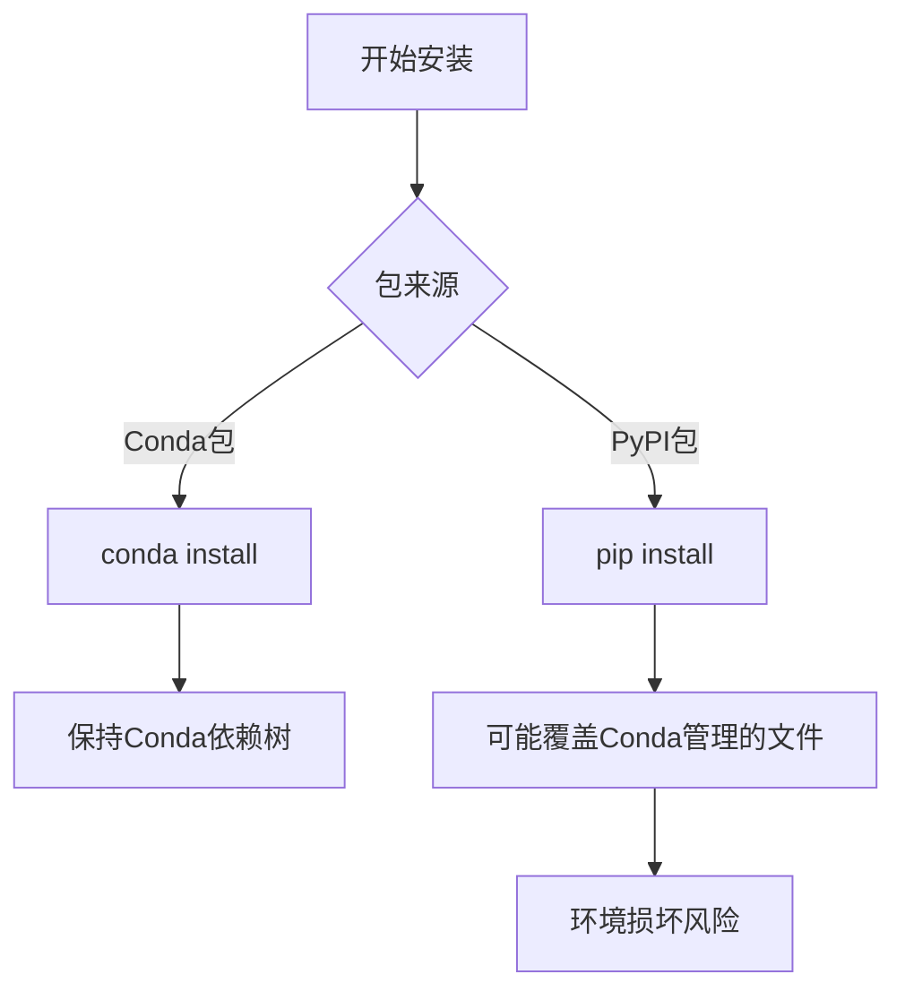
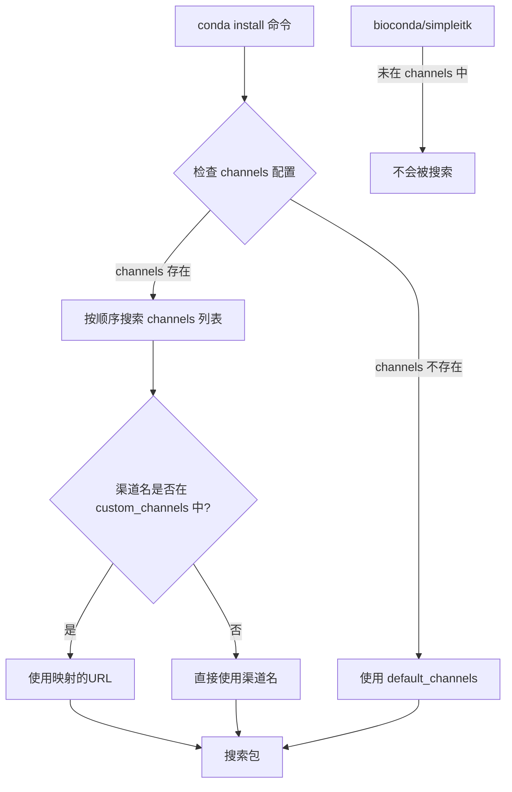

---
{"dg-publish":true,"permalink":"/基本配置/miniConda/"}
---


- [官方网站](https://www.anaconda.com/docs/getting-started/miniconda/main)

- 常用命令
```powershell
# 打开Jupyter notebook #
jupyter lab

# 切换环境
conda activate env_name

# 创建环境
conda create env env_name

# 安装package，记得先切换到对应的env
conda install package_name

#添加完channel 镜像后记得清理
conda clean -i

#更新 Conda 环境中的包
conda update --all

#更新某个包：
conda update package-name

#源操作
#查看当前使用的源
conda config --show-sources
#删除指定的源
conda config --remove channels <channel_name>
#添加指定的源
conda config --add channels <channel_name>

#列出使用的命令在哪里，是全局的还是特定环境的
conda list pip


  
```


### 当切换到某个特定环境后，再使用当前环境下的pip install，则也只会给当前环境安装指定包

但要注意conda install和pip install混用问题，可能会导致依赖冲突

您提出了一个非常关键的问题！虽然 pip install 在激活环境后确实能安装到当前环境，但不能完全替代 conda install。以下是何时使用哪种工具的专业建议：
优先使用 conda install 的场景 ✅


使用 pip install 的场景 ✅

⚠️ 重要警告：混合使用的风险




### 最佳实践原则：
80/20 法则：80% 的包用 conda install，20% 特殊包用 pip
安装顺序：先 conda install 所有可能包，最后用 pip 补充
隔离策略：对复杂项目创建纯 PIP 环境（venv）而非 Conda




- conda配置文件、镜像源配置
  配置文件所在地：- Windows: `C:\Users\<用户名>\.condarc`

- 我的环境配置
	
	- base
	- jancis
	- myAnimateDiff
	- mySelenium  为学习[[Selenium\|Selenium]]创建，pip了 Selenium包